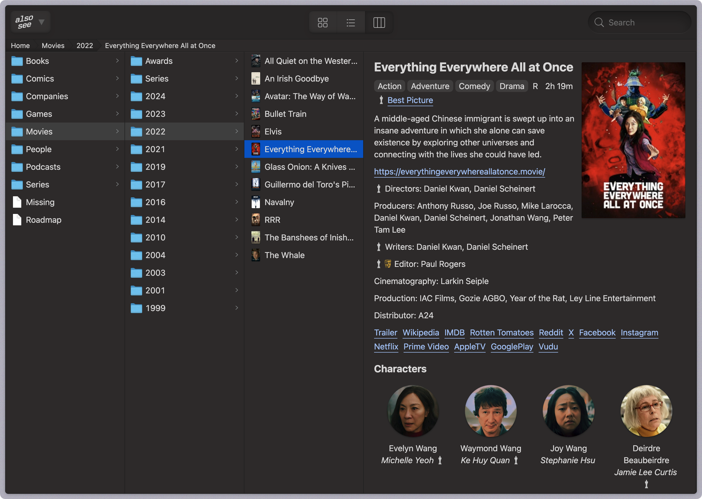

# finder

[](https://github.com/alsosee/finder/actions/workflows/main.yml)
[](https://github.com/alsosee/finder/actions/workflows/deploy.yml)

A project to bring the Finder experience to the web.



It is part of a larger project to store information in a structured way:

* [info](https://github.com/alsosee/info)
* [media](https://github.com/alsosee/media)

On a high level, `finder` takes a `info` directory and generates a static website that served via Cloudflare Pages.
It also procceses the `media` directory and generates thumbnails sprites for all directories and images, and uploads them to Cloudflare R2 Storage.

On a lower level, `finder` walks the `info` directory, using go routines to process each YAML file concurrently.
While doing so, it keeps track of all "connections" between files, to use later in go templates.

## Local development

Use Make to build the static site locally:

```bash
export INPUT_INFO=/<path-to-info-directory>/info
export INPUT_MEDIA=/<path-to-media-directory>/media
export INPUT_STATIC=static
export INPUT_OUTPUT=output

make serve
```

Then press <kbd>b</kbd> that will open URL like this https://127.0.0.1:8788/ in your browser.

## Architecture decisions log

[Finder Federation](https://docs.google.com/document/d/1ygAVjABPIJ7oNBH8phhP0mpEP_WQsUQ_xxMwOpSCUHg/edit#heading=h.p1dqhy5mhxb1) – reduce couping between `finder` and `info` repositories