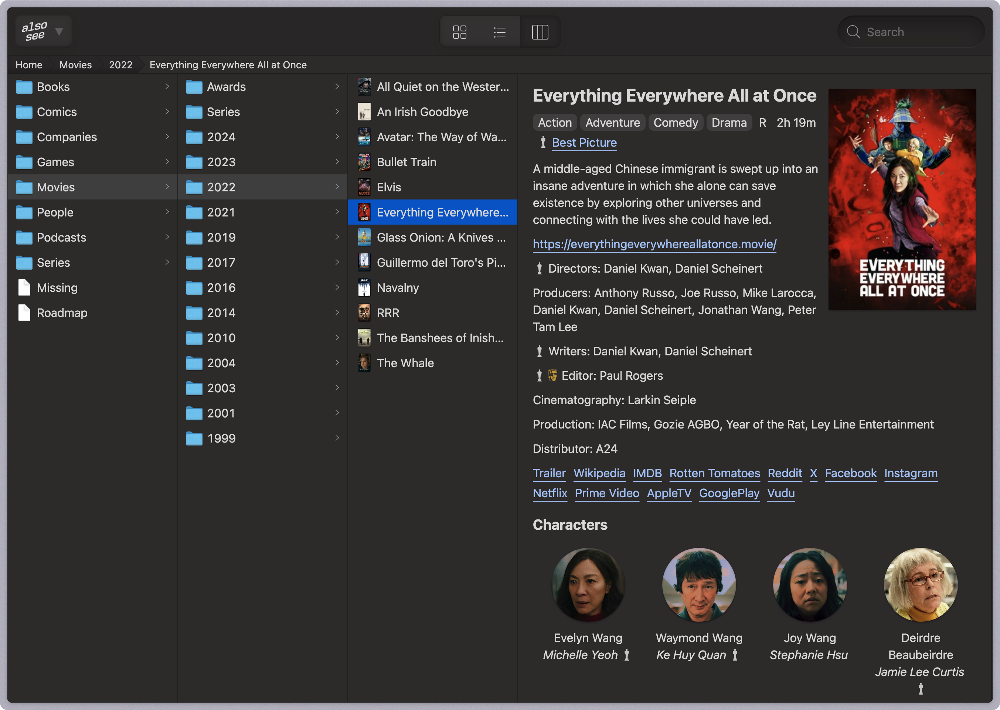

# finder

[](https://github.com/alsosee/finder/actions/workflows/main.yml)
[](https://github.com/alsosee/finder/actions/workflows/deploy.yml)

A project to bring the Finder experience to the web.



It is part of a larger project to store information in a structured way:

* [info](https://github.com/alsosee/info)
* [media](https://github.com/alsosee/media)

On a high level, `finder` takes a `info` directory and generates a static website that is served from Cloudflare R2.
It also procceses the `media` directory and generates thumbnails sprites for all directories and images, and uploads them to Cloudflare R2 Storage.
Interactive API routes live in a Cloudflare Worker under `/api/*`.

On a lower level, `finder` walks the `info` directory, using go routines to process each YAML file concurrently.
While doing so, it keeps track of all "connections" between files, to use later in go templates.

## Local development

Use Make to build the static site locally:

```bash
export INPUT_INFO=/<path-to-info-directory>/info
export INPUT_MEDIA=/<path-to-media-directory>/media
export INPUT_STATIC=static
export INPUT_OUTPUT=output

make serve
```

Then press <kbd>b</kbd> that will open URL like this https://127.0.0.1:8788/ in your browser.

## Worker

The Worker in `worker/` serves the static site from an R2 bucket and handles interactive API routes:

- `PUT /api/upload`
- `POST /api/image-proxy`

Static requests are resolved like Pages-style routes: `/` loads `index.html`, trailing-slash paths load `index.html`, extensionless paths try `.html` and then `index.html`, and misses serve `404.html` with a 404 status.

`worker/wrangler.toml` is local-development configuration. Projects that consume `finder` own their production Worker deployment config, route, R2 bindings, and secrets. Production configs should route the full site host to the Worker and bind the static site bucket as `SITE`.
When Worker source changes, `.github/workflows/worker.yml` notifies known downstream projects so they can deploy with their own configuration.

## Architecture decisions log

[Finder Federation](https://docs.google.com/document/d/1ygAVjABPIJ7oNBH8phhP0mpEP_WQsUQ_xxMwOpSCUHg/edit#heading=h.p1dqhy5mhxb1) – reduce couping between `finder` and `info` repositories
